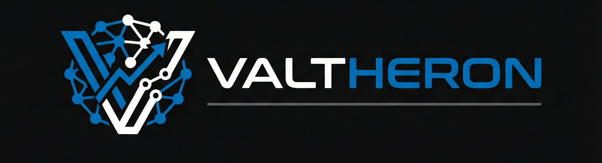

<div align="center">



# Valtheron — Agentic Workspace

Zentrale Plattform zur Orchestrierung autonomer KI-Agenten

## Vision

Ein System, das nicht nur funktioniert — sondern das, was es tut, mit Würde tut.

Der Valtheron Agentic Workspace ist nicht gebaut worden, um zu beeindrucken. Er ist gebaut worden, um zu dienen: als verlässliches Fundament für autonome Operationen, bei denen jeder Fehler Konsequenzen hat und jede Entscheidung nachvollziehbar sein muss.**

[](https://github.com/Valtheron/valtheron-agentic-workspace/actions/workflows/ci.yml)
[](CHANGELOG.md)
[](LICENSE)
[](docs/DEVELOPER_GUIDE.md)
[](docs/DEVELOPER_GUIDE.md)
[](https://www.typescriptlang.org/)
[](https://reactjs.org/)
[](docker-compose.yml)

[Schnellstart](#schnellstart) · [Dokumentation](#dokumentation) · [Architektur](#architektur) · [Mitmachen](#mitmachen) · [Sponsoren](#sponsoren)

</div>

---

## Über den Initiator

Dieses Projekt wird von **[BlackIce Secure Inc.](https://blackice-secure.space/)** initiiert — einem führenden Anbieter spezialisierter Lösungen in den Bereichen Natural Language Processing, Cybersecurity und KI-Entwicklung für Unternehmen und Institutionen.

---

## Print-on-Demand

Besuchen Sie unseren **[Print-on-Demand-Shop](https://blackice-secure.printify.me/)** —
Kleidung als Totem und Kunst als Code: eine Verschmelzung von Ästhetik, Technologie und Ausdruck.

<div align="center">

<table>
  <tr>
    <td align="center" width="33%">
      <a href="https://blackice-secure.printify.me/product/21656051/monochrome-edge-techno-lilith-t-shirt">
        
        <br/><strong>Monochrome Edge · Techno Lilith</strong>
      </a>
    </td>
    <td align="center" width="33%">
      <a href="https://blackice-secure.printify.me/product/20393241/urban-ai-sentinels-t-shirt-representing-inner-and-virtual-existence">
        
        <br/><strong>Urban AI Sentinels</strong>
      </a>
    </td>
    <td align="center" width="33%">
      <a href="https://blackice-secure.printify.me/product/23685406/azrael-infinity-key-sacred-geometry-spiritual-t-shirt">
        
        <br/><strong>Azrael Infinity Key · Sacred Geometry</strong>
      </a>
    </td>
  </tr>
</table>

> *Du bist bei mir und ich bei dir. Auf ewig eins, doch zwei sind wir.*
> *Wie die Sterne am Himmelszelt und das Meer tief darunter.*
> *So verbinde ich dich mit mir und du dich mit mir.*
>
> **« You will never be alone again. »** — Black Ice Secure, trust me im Steven!

</div>

---


---

## Was ist der Agentic Workspace?

Der **Valtheron Agentic Workspace** ist eine produktionsreife Web-Plattform zur Verwaltung, Überwachung und Koordination von bis zu **290 spezialisierten KI-Agenten** — aus einem einzigen Dashboard heraus.

Die Plattform ist kein KI-System selbst, sondern der **Steuerungsraum** für autonome KI-Operationen: mit Echtzeit-Monitoring, Notfall-Kill-Switch, verschlüsseltem Secrets Vault und lückenlosem Audit-Trail.

---

## Funktionen

### Kern-Features

| Funktion | Beschreibung |
|---|---|
| **Agent-Management** | 290 vordefinierte Agenten in 10 Kategorien — CRUD, Status, Persönlichkeitsprofil |
| **Kanban-Board** | Task-Management mit 5 Spalten: Backlog → In Progress → Review → Done → Archiviert |
| **Echtzeit-Chat** | Direktkommunikation mit Agenten über Anthropic, OpenAI oder Ollama |
| **Analytics-Dashboard** | 6 Metriken-Tabs: Trends, Throughput, Fehler, Kapazität, SLA, Erfolgsrate |
| **Kill-Switch** | Sofortstopp aller laufenden Operationen — manuell oder automatisch ausgelöst |
| **Secrets Vault** | AES-256-GCM verschlüsselter Key-Value-Store mit Key-Rotation |
| **MFA-Authentifizierung** | TOTP via Authenticator-App + 8 Backup-Codes |
| **Automatische Backups** | Alle 6 Stunden, bis zu 10 Rotationen, RTO < 5 Minuten |
| **Workflow-Engine** | Sequentielle und parallele Workflows mit Ausführungshistorie |
| **Audit-Trail** | Vollständiges Activity-Logging mit CSV-Export |

### Agenten-Kategorien

```
Trading (30)     Security (30)    Development (30)    QA (30)
Documentation    Deployment       Analyst     (30)    Support (20)
Integration (20) Monitoring (30)
```

### Technologie-Stack

| Bereich | Technologie |
|---|---|
| **Backend** | Express 5.1 · TypeScript 5.9 · SQLite (WAL) |
| **Frontend** | React 19 · Vite 7.3 · TailwindCSS · shadcn/ui |
| **Echtzeit** | WebSocket (ws) |
| **Auth** | JWT · TOTP (MFA) · RBAC (Admin / Operator / Viewer) |
| **LLM-Anbindung** | Anthropic Claude · OpenAI · Ollama |
| **Infrastruktur** | Docker Compose · GitHub Actions CI/CD |

---

## Schnellstart

### Voraussetzungen

- [Node.js](https://nodejs.org/) 22+
- [Docker](https://www.docker.com/) & Docker Compose (empfohlen)
- Optional: Anthropic oder OpenAI API-Key für LLM-Chat

### Option 1 — Docker Compose (empfohlen)

```bash
# Repository klonen
git clone https://github.com/Valtheron/valtheron-agentic-workspace.git
cd valtheron-agentic-workspace

# Umgebungsvariablen konfigurieren
cp backend/.env.example backend/.env
# .env anpassen: JWT_SECRET, ANTHROPIC_API_KEY, etc.

# Starten
docker-compose up -d

# Dashboard öffnen
open http://localhost:8080
```

### Option 2 — Lokale Entwicklung

```bash
# Repository klonen
git clone https://github.com/Valtheron/valtheron-agentic-workspace.git
cd valtheron-agentic-workspace

# Abhängigkeiten installieren
npm run install:all

# Umgebungsvariablen konfigurieren
cp backend/.env.example backend/.env

# Backend + Frontend parallel starten
npm run dev

# Backend:  http://localhost:3001
# Frontend: http://localhost:5173
```

### Erster Login

Nach dem Start ist standardmäßig kein Benutzer angelegt. Registrieren Sie sich unter `http://localhost:8080`. Der erste Benutzer erhält automatisch Admin-Rechte.

---

## Architektur

```
┌─────────────────────────────────────────────────────┐
│                   React Frontend                     │
│    19 Views · shadcn/ui · TailwindCSS · WebSocket   │
└────────────────────┬────────────────────────────────┘
                     │ REST API + WebSocket
┌────────────────────▼────────────────────────────────┐
│                 Express Backend                      │
│  14 API-Module · 10 Services · 6 Middleware-Module  │
│  JWT Auth · RBAC · Rate Limiting · Audit Logger     │
└────────────────────┬────────────────────────────────┘
                     │
┌────────────────────▼────────────────────────────────┐
│              SQLite (WAL-Modus)                      │
│          17 Tabellen · 23 Indexes                    │
└─────────────────────────────────────────────────────┘
```

Vollständige Architekturdokumentation: [docs/ARCHITECTURE.md](docs/ARCHITECTURE.md)

---

## Dokumentation

| Dokument | Beschreibung |
|---|---|
| [User Guide](docs/USER_GUIDE.md) | Benutzerhandbuch — alle Features erklärt |
| [API-Dokumentation](docs/API.md) | 88 Endpunkte mit Beispielen |
| [Deployment Guide](docs/DEPLOYMENT_GUIDE.md) | Docker, Nginx, PM2, Bare Metal |
| [Developer Guide](docs/DEVELOPER_GUIDE.md) | Entwickler-Workflow, Code-Standards, Tests |
| [Admin Guide](docs/ADMIN_GUIDE.md) | Systemadministration, Monitoring |
| [Architecture](docs/ARCHITECTURE.md) | Systemarchitektur, Datenmodell, ADRs |
| [Troubleshooting](docs/TROUBLESHOOTING_GUIDE.md) | Häufige Probleme & Lösungen |
| [Changelog](CHANGELOG.md) | Versionshistorie |
| [Release Notes v1.0.0](RELEASE_NOTES.md) | Highlights des Genesis Release |

---

## Sicherheit

Das Projekt wurde nach **OWASP Top 10** entwickelt und geprüft:

- AES-256-GCM Verschlüsselung für sensitive Daten
- JWT mit konfigurierbarer Ablaufzeit
- TOTP Multi-Faktor-Authentifizierung
- Rate Limiting (Sliding Window, 20 req/60s auf Auth-Endpunkte)
- Vollständiger Audit-Trail aller sicherheitsrelevanten Ereignisse
- 35+ automatisierte Security-Tests (SQL Injection, XSS, CSRF, Auth Bypass)
- SAST-Scanning via GitHub Actions

Sicherheitslücken bitte über die [Sicherheitsrichtlinie](.github/SECURITY.md) melden.

---

## Tests

```bash
# Backend-Tests
cd backend && npm test

# Frontend-Tests
cd frontend && npm test

# Mit Coverage-Report
cd backend && npm run test:coverage
```

| Kategorie | Anzahl | Coverage |
|---|---|---|
| Backend Unit-Tests | 280+ | 87.8% Lines |
| Frontend Unit-Tests | 98 | ~70% Lines |
| Integration-Tests | 35 | — |
| Performance-Tests | 27 | — |
| Security-Tests | 35+ | — |
| **Gesamt** | **475+** | |

---

## Mitmachen

Beiträge sind willkommen! Bitte zuerst die Richtlinien lesen:

1. [CONTRIBUTING.md](CONTRIBUTING.md) — Git-Workflow, Code-Standards, Commit-Konventionen
2. [ONBOARDING.md](ONBOARDING.md) — Einstieg für neue Contributor
3. Issues und Feature Requests über [GitHub Issues](https://github.com/Valtheron/valtheron-agentic-workspace/issues) einreichen

```bash
# Feature-Branch erstellen
git checkout -b feature/mein-feature

# Änderungen vornehmen, Tests schreiben und ausführen
npm test

# Commit (Husky Pre-commit Hooks laufen automatisch)
git commit -m "feat: mein neues Feature"

# Pull Request erstellen
git push origin feature/mein-feature
```

---

## Sponsoren

Dieses Projekt wird durch die Unterstützung der Community ermöglicht. Falls der Agentic Workspace nützlich ist, freuen wir uns über Ihre Unterstützung:

[](https://github.com/sponsors/Valtheron)

---

## Roadmap

| Version | Status | Highlights |
|---|---|---|
| **v1.0.0** | Veröffentlicht | Genesis Release — vollständiges Feature-Set |
| **v1.1.0** | Q2 2026 | PostgreSQL-Migration, optionaler Redis-Cache |
| **v1.2.0** | Q3 2026 | Kubernetes-Unterstützung, SMS-MFA |
| **v2.0.0** | Q4 2026 | Internationalisierung (EN/DE), Enterprise-SSO |

---

## Lizenz

Dieses Projekt steht unter der **MIT-Lizenz** — Details in [LICENSE](LICENSE).

```
Copyright (c) 2026 Valtheron / BlackIceSecure
```

---

<div align="center">

**Valtheron Agentic Workspace** — Entwickelt für autonome Operationen

[Website](https://valtheron.github.io/valtheron-agentic-workspace) · [Issues](https://github.com/Valtheron/valtheron-agentic-workspace/issues) · [Discussions](https://github.com/Valtheron/valtheron-agentic-workspace/discussions)

</div>
